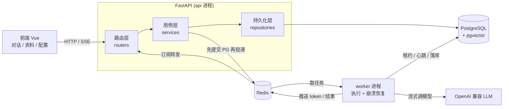
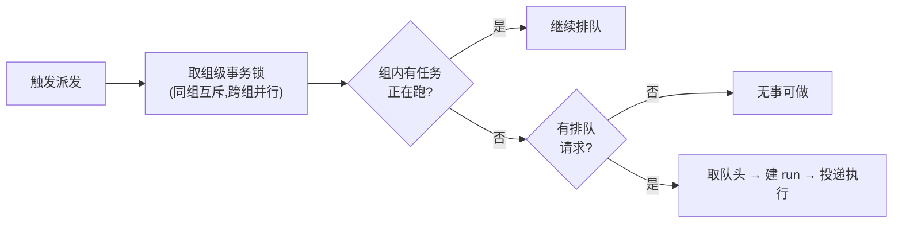
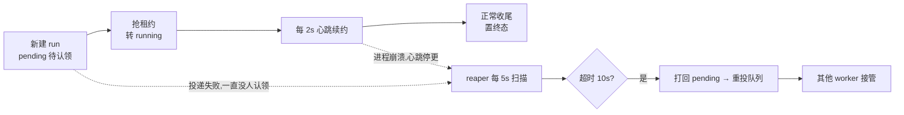
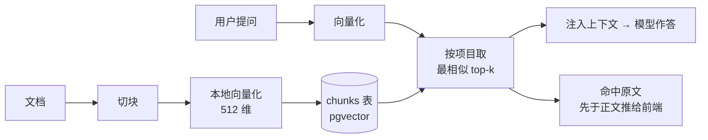
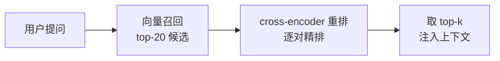

# Ragent · 精简版 AI Agent 知识库应用

一个"小而精"的 AI Agent 知识库应用：把一条**能扛并发、可恢复、结果可追溯**的请求链路做扎实，而不是堆功能。用户提问后先落库拿 ID 立即返回，再按 `(用户, Agent, 会话)` 三元组 FIFO 串行排队，由独立 worker 抢租约执行、心跳续约、崩溃可自动恢复，最后用 SSE 把答案流式推回前端。RAG 检索命中的资料对用户**明确可见**，不是黑盒。

技术栈：FastAPI + LangGraph + PostgreSQL(pgvector) + Redis + Vue 3。

## 亮点

- **落库即返回**：提问先写库拿 `request_id` 立刻返回，慢的模型执行交给后台，接口始终轻快。
- **三元组 FIFO 调度**：同一 `(用户, Agent, 会话)` 的请求严格串行，不同组并行；调度键含 Agent，同一会话切换 Agent 会各自独立排队。
- **崩溃自动恢复**：worker 抢租约执行、定时心跳续约；进程崩了心跳停更，后台 reaper 扫到超时租约会自动把任务重投给活着的 worker。
- **SSE 流式 + 晚连补读**：答案逐字实时推送；即使客户端在执行完成后才连上，也能从数据库补读到完整结果。
- **RAG 可观测**：检索命中的资料原文先于正文推出，答案上方展示"本次检索到 N 条资料"，可展开看原文。
- **两阶段检索 + 可量化评测**：向量召回后接 cross-encoder 重排取 top-k，配一套带标注问答集的评测脚本，用 Recall / MRR / nDCG 量化重排收益与延迟代价。
- **Skill + MCP 双工具**：本地函数工具(计算器/时间)与独立进程的 MCP 工具(天气)用同一套机制挂到 Agent 上。
- **项目分区**：按项目归档会话与资料，同项目多 Agent 共享一份知识库，密钥不内置、由用户自行配置。

## 技术栈

| 层 | 选型 | 说明 |
|---|---|---|
| 后端框架 | FastAPI | 原生 async，贴合高并发 IO 等待场景；路由保持薄，逻辑在 service 层 |
| Agent 编排 | LangGraph | RAG / Skill / MCP 都是挂在图上的节点或工具，加能力只需往工具清单里加一项 |
| 主数据库 | PostgreSQL + pgvector | 业务数据与向量检索一库搞定，不额外引入专用向量库 |
| 队列 / 实时 | Redis | 只做任务投递、短期事件、SSE 通道，不持有最终业务状态 |
| 向量模型 | fastembed (bge-small-zh-v1.5) | 本地 ONNX 运行，离线免费，无需外部 embedding API |
| 前端 | Vue 3 + Vite | 轻量，界面仿 Claude 网页版暖色风格 |

## 整体架构

api 与 worker 是两个独立进程、不共享内存，**数据库是唯一共享真相**；Redis 只负责任务投递和实时推送。



## 并发调度：三元组 FIFO 串行

同一 `(用户, Agent, 会话)` 组内的请求严格按先后顺序串行执行，不同组之间并行互不影响。"谁能跑"收敛成一个函数，无论是新请求进来还是上一个任务跑完想拉下一个，都走同一套判定。



先取**组级事务锁**(PostgreSQL advisory 锁)，保证同组两个请求同时进来时派发判定串行、不会都被放行；锁按组隔离，跨组不阻塞，事务结束自动释放。

## 崩溃恢复：租约 + 心跳 + reaper

正在执行的任务必须有明确的执行者(租约)和存活证明(心跳)。任务创建时为 `pending`(待认领)，worker 抢到才转 `running`。reaper 兜底两类"孤儿"：执行中崩溃(心跳停更)的，和创建后一直没被认领的(投递失败、从没进过队列)，都打回 `pending` 重投给活着的 worker，任务不会永远悬着。



续约间隔(2s)远小于超时阈值(10s)，给网络抖动留足余量，避免误判还活着的 worker。抢占以状态为原子闸门：重复投递或 reaper 重投时，只有第一个能把 run 从 `pending` 翻成 `running`，其余落空，不会两个 worker 跑同一个任务。

## RAG 检索与可观测

资料入库时切块并向量化存入 pgvector；提问时把问题向量化，按项目范围取最相似的若干块注入上下文。命中的原文会单独推给前端展示，让"检索到了什么"透明可见。



检索按项目圈定，只在本项目资料里找；关闭检索的 Agent(通用助手)直接跳过这一步，方便对照 RAG 效果。

## 两阶段检索与评测

单纯向量召回按语义相似度排序，语义接近但答非所问的块可能排在前面。这里在召回后加一层 cross-encoder 重排：先向量召回较多候选，再由重排模型对"问题-候选"逐对精排，取前几条注入上下文。



配套一套人工标注的问答集(埋了易混淆的跨类干扰项)和评测脚本，用 Recall@k / MRR / nDCG@k 对比"纯向量"与"向量+重排"，并分别报告延迟。实测重排把 top-1 命中率显著拉高，代价是每次查询增加约数百毫秒——脚本把收益和代价都摆在明面上，而不是只报好看的数字。

实测结果(语料 39 篇 / 人工标注 211 问，纯离线可复现)：

| 指标 | 纯向量 | 向量+重排 |
|---|---|---|
| Recall@1 | 94.8% | 98.6% |
| Recall@3 | 99.5% | 100.0% |
| MRR | 0.971 | 0.993 |
| nDCG@10 | 0.978 | 0.995 |
| 单次检索延迟 p50 | 3.1ms | 529.8ms |

重排把首位命中率从 94.8% 提到 98.6%(MRR 0.971→0.993)，代价是每次多约 520ms 的 CPU 精排。语料是边界清晰的制度文档，向量召回本身已经很强，所以分数偏高属数据特性；每个问题只标一篇正确文档(单正例)，因此 Recall@k 等于命中率、理想 nDCG 上界为 1，这些局限在报告里如实标注。

```bash
docker compose exec worker python -m app.eval.rag_eval
```

## 数据模型

把"用户请求"和"系统执行"拆成两个状态模型：

- **messages**：会话里展示的问答文本；助手回复绑定 `request_id`，晚连的客户端据此精确取回本次结果。
- **agent_run_requests**（用户视角）：一提问就落一条并立即返回，记录状态 queued / dispatched / done / failed。
- **agent_runs**（系统视角）：请求排到队头真正开跑时才创建，状态 pending / running / done / failed，记录一次执行的生命周期与租约信息。
- **projects / agents / threads**：项目分区、多 Agent、会话；调度键的 Agent 段来自会话绑定的 Agent。
- **documents / chunks**：资料与向量块，归属项目、级联删除。
- **llm_config**：单行表，保存当前生效的 OpenAI 兼容配置，供 api 与 worker 两个进程读取同一份。

## 快速开始

### 1. 启动后端

```bash
docker compose up --build
```

一条命令拉起 4 个容器：`postgres`(pgvector) / `redis` / `api` / `worker`。首次启动自动建表，并在库为空时播种一个示例项目(含 3 个 Agent 与 3 篇示例资料)。

- API：http://localhost:8000
- 健康检查：`GET /health`(进程存活)、`GET /ready`(依赖连通)

### 2. 启动前端

```bash
cd web
npm install
npm run dev
```

打开 Vite 输出的地址(默认 http://localhost:5173)。

### 3. 配置模型

项目**默认不内置任何密钥或服务地址**。首次使用在应用「模型配置」页填写任意 OpenAI 兼容服务的 `base_url` 与 `api_key`(可一键拉取模型列表)。DeepSeek 等本身就是 OpenAI 兼容接口，靠 `base_url` 区分，无需改代码。密钥只存本地，不回显明文、不提交到仓库。

## 目录结构

```
backend/
  app/
    routers/        # 路由层:参数校验与转发
    services/       # 用例层:调度 / RAG / SSE / 配置等业务流程
    repositories/   # 持久化层:纯 SQL
    agent/          # LangGraph 图 + Skill + MCP + 向量化 + 重排
    eval/           # 检索评测:标注问答集 + Recall/MRR/nDCG 脚本
    worker.py       # 独立执行进程:租约 / 心跳 / 崩溃恢复
    schema.sql      # 建表(幂等)
web/
  src/
    pages/          # 对话 / 资料管理 / 模型配置
    components/     # 侧栏 / 消息气泡 / 弹窗
    store.js        # 轻量全局状态
    sse.js          # SSE 流式读取
docker-compose.yml
```
