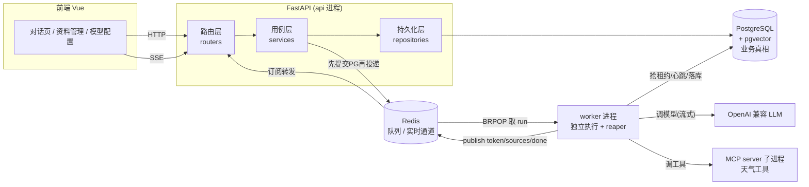
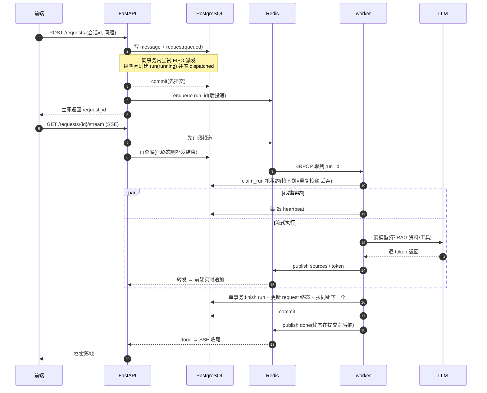
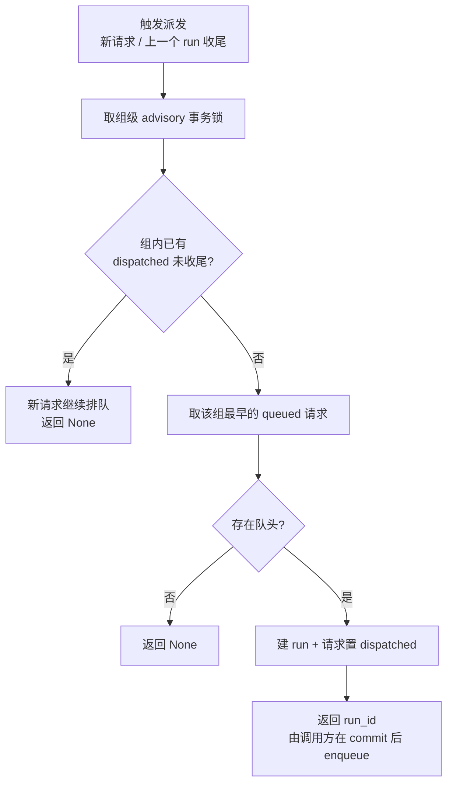
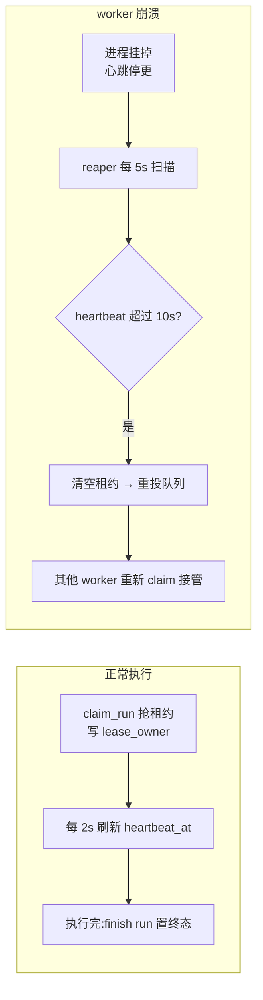
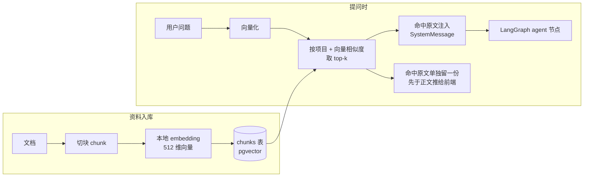

# Ragent · 精简版 AI Agent 知识库应用

一个"小而精"的 AI Agent 知识库应用，把一条**能扛并发、可恢复、结果可追溯**的请求主链路做扎实，而不是堆功能。用户提问后先落库拿 ID 立即返回，再按 `(用户, Agent, 会话)` 三元组 FIFO 串行排队，由独立 worker 抢租约执行、心跳续约、崩溃可恢复，最后用 SSE 把答案流式推回前端。RAG 检索命中的资料对用户**明确可见**，不是黑盒。

> 秋招面试个人项目。技术栈：FastAPI + LangGraph + PostgreSQL(pgvector) + Redis + Vue 3。

## 亮点一览

- **落库即返回**：提问先写库拿 `request_id` 立刻返回，慢的 LLM 执行交给后台，接口永远轻快。
- **三元组 FIFO 调度**：同一 `(用户, Agent, 会话)` 的请求严格串行，不同组并行；调度键含 Agent，天然支持"一会话多 Agent 各自独立排队"。
- **先提交 PG 再投递 Redis**：业务真相只在 PostgreSQL，Redis 只做投递/实时通道；投递前所属事务一定已提交，worker 取到时库里必有该记录。
- **租约 + 心跳 + reaper**：worker 抢租约执行、定时续约；进程崩了心跳停更，reaper 扫到超时租约自动重投给活着的 worker，非终态 run 不会永远悬着。
- **SSE 先订阅再查库**：解决"POST 返回到 SSE 连上之间 run 已跑完"的漏推竞态；晚连也能从库里补读完整结果。
- **RAG 可观测**：检索命中的资料原文先于正文流式推出，前端答案上方展示"本次检索到 N 条资料"，可展开看原文。
- **Skill + MCP 双工具**：本地 Skill(计算器/时间) 与独立进程的 MCP server(天气) 用同一套 `bind_tools` 机制挂到图上，演示两种工具接入范式。
- **项目分区**：像 Codex 那样按项目归档会话与资料，同项目多 Agent 共享一份知识库。

## 技术栈

| 层 | 选型 | 为什么 |
|---|---|---|
| 后端框架 | FastAPI | 原生 async，贴合"高并发 IO 等待"场景；路由保持薄，逻辑在 service 层 |
| Agent 编排 | LangGraph | RAG/Skill/MCP 都是挂在图上的节点/工具，加能力只需往工具清单里加一项 |
| 主数据库 | PostgreSQL + pgvector | 业务真相 + 向量检索一库搞定，不额外引专用向量库 |
| 队列/实时 | Redis | 只做投递、短期事件、SSE 通道，不持有最终业务状态 |
| 向量模型 | fastembed(bge-small-zh-v1.5) | 本地 ONNX 运行，离线免费稳定，无需外部 embedding API |
| 前端 | Vue 3 + Vite | 轻量，组件颗粒度合理；界面仿 Claude 网页版暖色风格 |

## 整体架构



**分层约束**：路由只做参数校验与转发(薄)，用例流程在 `services`，SQL 在 `repositories`。api 与 worker 是两个进程、不共享内存，**数据库是唯一共享真相**——这也是"LLM 配置落库而不只用环境变量"的原因。

## 关键链路一：一次提问的完整生命周期



**两个时序不变量**（面试重点）：

1. **先提交 PG，再投递 Redis**：若先投递后提交，worker 可能在事务提交前就取到 run，查库却查不到 → 数据不一致。反过来则保证 worker 取到时库里必有记录。
2. **终态先写库、再推 SSE**：`done` 事件必须在事务 commit 之后推送，保证订阅者收到推送时库里已是同一终态，晚连(late-join)的客户端补读也一致。

## 关键链路二：三元组 FIFO 串行调度

同一 `(用户, Agent, 会话)` 组内请求严格串行，跨组并行。"谁能跑"收敛成唯一函数 `try_dispatch_group`——无论是新请求进来，还是上一个 run 跑完想拉下一个，都调它。



**并发关键**：先取**组级事务锁**(`pg_advisory_xact_lock`)，保证同组两个请求同时进来时派发判定串行、不会都被放行；锁按组隔离，跨组互不阻塞，锁随事务结束自动释放。

## 关键链路三：租约 / 心跳 / 崩溃恢复



**为什么这么设计**：非终态 run 必须有明确执行 Owner(`lease_owner`)和存活证明(`heartbeat_at`)。续约间隔(2s)远小于超时阈值(10s)，给网络抖动留足余量，避免误判活着的 worker；心跳一停，reaper 就能判定失联并把 run 重投给活着的 worker，保证崩溃后有可观察的结局，不会永远悬在 running。

## 关键链路四：RAG 检索与可观测



**RAG 不是黑盒**：检索命中的原文单独走一条 `sources` 事件、**先于正文 token** 推给前端，答案上方展示"本次检索到 N 条资料"并可展开看原文。检索按 `project_id` 圈定，只在本项目资料里找；`use_rag=false` 的 Agent(通用助手)直接跳过检索，方便肉眼对照 RAG 效果。

## 数据模型

把"用户请求"和"系统运行"拆成两个状态模型，是整条链路的账本：

- **messages**：会话里要展示的问答文本；assistant 回复绑定 `request_id`，SSE 晚连据此精确取本请求结果，不猜"最后一条"。
- **agent_run_requests**（用户视角）：一提问就落一条并立即返回，记录"想要什么"和"排到哪"(queued/dispatched/done/failed)。
- **agent_runs**（系统视角）：请求排到 FIFO 队头真正开跑时才建，记录一次执行的生命周期 + 租约(`lease_owner`/`heartbeat_at`)。
- **projects / agents / threads**：项目分区、多 Agent、会话；调度键的 agent 段来自 `threads.agent_id`。
- **documents / chunks**：资料与向量块，归属项目、级联删除。
- **llm_config**：单行表(`id=1`)，保存当前生效的 OpenAI 兼容配置；落库是为了让 api 与 worker 两个进程读到同一份。

## 快速开始

### 1. 启动服务

```bash
docker compose up --build
```

一条命令拉起 4 个容器：`postgres`(pgvector) / `redis` / `api` / `worker`。首次启动会自动建表，并在库为空时播种一个"示例项目"(含 3 个 Agent + 3 篇示例制度资料)。

- 后端 API：http://localhost:8000
- 健康检查：`GET /health`(进程存活) 、`GET /ready`(PG + Redis 都连通才返回 ok)

### 2. 启动前端

```bash
cd web
npm install
npm run dev
```

浏览器打开 Vite 输出的地址(默认 http://localhost:5173)。

### 3. 配置模型

项目**默认不内置任何密钥或服务地址**。首次使用请在应用「模型配置」页填写任意 OpenAI 兼容服务的 `base_url` + `api_key`(可点"拉取模型"自动获取模型列表)。DeepSeek 等本身就是 OpenAI 兼容接口，靠 `base_url` 区分，无需改代码。

> 密钥只存本地(`backend/.env` 已被 gitignore，或存本地数据库)，不会回显明文、不会提交到仓库。

## 目录结构

```
backend/
  app/
    routers/        # 路由层(薄):参数校验与转发
    services/       # 用例层:调度/RAG/SSE/配置等业务流程
    repositories/   # 持久化层:纯 SQL
    agent/          # LangGraph 图 + Skill + MCP + embedding
    worker.py       # 独立执行进程:抢租约/心跳/reaper
    schema.sql      # 建表(幂等)
web/
  src/
    pages/          # 对话 / 资料管理 / 模型配置
    components/     # 侧栏 / 消息气泡 / 弹窗
    store.js        # 轻量全局状态(项目/会话选择态)
    sse.js          # SSE 流式读取
docker-compose.yml  # 开发拓扑事实来源
```

## 面试讲解主线

这个项目的核心不是功能多，而是**一条工业级请求主链路的每个时序/并发决策都有理由**：落库即返回、三元组 FIFO、先提交再投递、租约心跳、reaper 恢复、SSE 先订阅再查库、终态先落库再推送、RAG 可观测。每个决策在代码里都有对应的中文注释说明"为什么这么做"。
